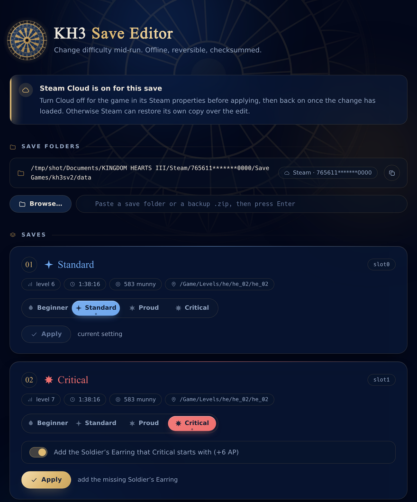
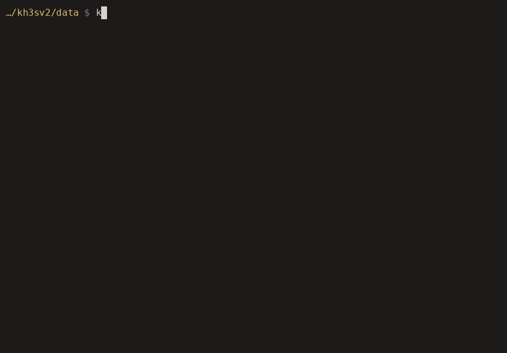

<div align="center">


# KH3 Save Editor

**Change the difficulty of a Kingdom Hearts III save mid-playthrough.**
Offline, reversible, and checksummed. No running game, no memory hooks, no
real-time capture.

[](https://github.com/thirteenth-order/kh3-save-editor/actions/workflows/ci.yml)
[](https://github.com/thirteenth-order/kh3-save-editor/releases/latest)
[](https://github.com/thirteenth-order/kh3-save-editor/releases)
[](https://pkg.go.dev/github.com/thirteenth-order/kh3-save-editor)
[](go.mod)
[](LICENSE)



</div>

## Install

Download the file for your system from
[**Releases**](https://github.com/thirteenth-order/kh3-save-editor/releases/latest)
and run it. Running it with no arguments opens the interface in your browser,
so on Windows you can simply double-click it.

| System | File |
| :-- | :-- |
| Windows | `kh3save-<version>-windows-amd64.exe` |
| macOS (Apple silicon) | `kh3save-<version>-darwin-arm64` |
| macOS (Intel) | `kh3save-<version>-darwin-amd64` |
| Linux | `kh3save-<version>-linux-amd64` |

One file, no installer, nothing to uninstall. Or with a Go toolchain:

```sh
go install github.com/thirteenth-order/kh3-save-editor/cmd/kh3save@latest
```

<details>
<summary><b>Windows and macOS will warn you the first time</b></summary>

<br>

These binaries are not code-signed, so Windows SmartScreen shows *"Windows
protected your PC"*. That is what an unsigned program from a small project
looks like, not evidence of a problem. Choose **More info** then **Run
anyway**, or check the SHA-256 against `SHA256SUMS` in the release first. A
signing certificate costs several hundred dollars a year, which this project
does not have.

On macOS, right-click the file and choose **Open** the first time, or run
`xattr -d com.apple.quarantine <file>`.

</details>

### Docker

For a run that touches nothing but the folder you point it at:

```sh
make docker-gui KH3_SAVES="$HOME/Documents/KINGDOM HEARTS III"
```

That builds the image and opens the interface on `127.0.0.1:8787`. Or without
`make`, and without the interface at all:

```sh
docker build -t kh3save:local .

docker run --rm --network none --read-only --cap-drop ALL \
  --security-opt no-new-privileges --user "$(id -u):$(id -g)" \
  -v "$HOME/Documents/KINGDOM HEARTS III:/saves" \
  kh3save:local info /saves
```

Mount the **`KINGDOM HEARTS III` folder itself**, not the `data` directory
inside it. The account id the key is derived from is one of the directory
names on the way down, so a mount that starts below it leaves nothing to
derive the key from and every file fails to decrypt. A backup `.zip` works
too: mount the folder holding it and pass the path to the zip.

<details>
<summary><b>What the image is, and what each flag takes away</b></summary>

<br>

The image is `FROM scratch`: one static binary, two empty directories and a
passwd entry. No shell, no libc, no package manager, nothing to escalate into.
It has no third-party Go dependencies to vendor, so the build downloads
nothing beyond the `golang` image itself.

| Flag | Why |
| :-- | :-- |
| `--network none` | Every CLI subcommand is offline by design. The interface is the only thing that needs a port. |
| `--read-only` | Nothing writes to the root filesystem. Temporary files are made beside the save, in the mount. |
| `--cap-drop ALL` | It opens files and one socket. Neither needs a capability. |
| `--security-opt no-new-privileges` | There is no setuid binary in the image to begin with; this makes that permanent. |
| `--user "$(id -u):$(id -g)"` | A container writes as whatever uid it runs as. Without this, an edited save comes back owned by uid 65532 and you cannot open it. |
| `-v ...:/saves` | The only path the container can see. Append `:ro` to look without touching. |

`compose.yaml` sets all of them, plus a tmpfs for the interface's folder list
so it never lands on disk. `make docker-cli ARGS="verify /saves"` runs a single
command in the networkless variant, and `tools/docker-smoke.sh` drives the
whole thing against a synthetic save -- CI runs it on every push.

Two things behave differently in a container. The interface cannot open a
folder picker, so it offers a text field instead; the mounted folder is
autodetected, so usually there is nothing to type. And the clock is UTC, which
is what timestamps a backup filename.

</details>

<details>
<summary><b>Publishing the port</b></summary>

<br>

Outside a container the interface binds `127.0.0.1` on a random port, which is
the first of the four gates described in `internal/gui/server.go`. Loopback
inside a network namespace is reachable from nothing at all, so the image
opts out of that one gate with `$KH3_ADDR` and lets the container boundary
stand in for it. The other three -- a fresh token per run, a Host check, and
the `Sec-Fetch-Site` check -- apply exactly as they always do, and the smoke
test asserts each of them through a published port.

So publish it to loopback, and nowhere else:

```sh
-p 127.0.0.1:8787:8787     # good
-p 8787:8787               # every interface on the machine, and past most firewalls
```

Use the same number on both sides. The Host check compares the port, so a
container published on 9000 while listening on 8787 refuses its own URL. To
move it, move both: `KH3_PORT=9000 make docker-gui KH3_SAVES=...`.

</details>

## Before you edit anything

1. **Close Kingdom Hearts III.** It rewrites the entire save file when it
   saves, so a change made while it is running is simply overwritten.
2. **Turn off Steam Cloud** for the game in its Steam properties. Otherwise
   Steam can restore its own copy over your edit. Turn it back on once the
   change has loaded.

Every change writes a timestamped `.bak` beside the file, and the result is
re-read and verified before it is committed to disk. If verification fails,
nothing is written.

## What a difficulty change actually involves

Three things are stored in the save and have to be edited together. Everything
else that Critical changes (damage taken, EXP rate, MP charge time, situation
command build-up, AP) is a runtime multiplier the game derives from the flag
by itself.

| | Beginner | Standard | Proud | Critical |
| :-- | :-: | :-: | :-: | :-: |
| Damage taken | 0.5x | 1x | 1.5x | 2x + 10 |
| EXP gained | 1.25x | 1x | 1x | 0.75x |
| Critical Counter, Recharge, Converter | | | | granted |
| Party HP and MP | | | | halved |
| Soldier's Earring at start | | | | yes |

Swapping between Beginner, Standard and Proud is therefore a single byte.
Moving to or from Critical is not, and this is where a hand-edit goes wrong:

```console
$ kh3save swap KHIII_slot1.bin -d Critical
  difficulty 0x14: Standard -> Critical
  Sora ability 0x068 Critical Counter:   granted (0x00000444 -> 0x0000044B)
  Sora ability 0x069 Critical Recharge:  granted (0x00000444 -> 0x0000044B)
  Sora ability 0x06A Critical Converter: granted (0x00000444 -> 0x0000044B)
  Sora current HP: 145 -> 72
  Sora current MP: 115 -> 57
  Donald current HP: 150 -> 75
  Goofy current HP: 160 -> 80
  backup -> KHIII_slot1.bin.bak.20260905-130957
```

Add `-n` to preview without writing. Coming back down reverses all of it, with
guards: an ability granted by a keyblade rather than by difficulty is left
alone, because removing it would desync the save from the gear still equipped.

## Command line

The interface covers the common case. The CLI covers the rest.

```sh
kh3save                              # open the interface
kh3save info      <save|dir|zip>...  # header fields
kh3save verify    <save|dir|zip>...  # check both integrity fields
kh3save swap      <save>  -d Proud   # difficulty, faithfully
kh3save abilities <save>             # per-character ability list
kh3save diff      <a> <b>            # byte diff of two saves
kh3save rekey     <save>  -to <id>   # move a save between Steam accounts
kh3save dump      <save>  -o s.json  # render as JSON
kh3save patch     <save>  s.json     # apply a partial JSON document
```

The account id is detected from the save path. Override it with `-account` or
`$KH3_ACCOUNT`. In-place edits are always backed up first.

### What it looks like

Nothing below is mocked up: the binary is real and the output is whatever it
actually printed. The saves are not. They are built by `tools/genfixture` and
keyed to an account that belongs to nobody, because a real save embeds its
owner's SteamID64 and their whole playthrough, which is not a thing to put in
a README. `tools/demo/README.md` covers how the recordings are made.

`info` reads a folder without touching it:


`swap` reports exactly the same thing with `-n` as without it. The only
difference is whether the last two lines happen:


`verify` checks both integrity fields, which is what a single flipped byte
anywhere in the file runs into:


### Backup archives

A backup of a save folder is usually a `.zip` of the whole
`KINGDOM HEARTS III` tree, so one works anywhere a save folder does, without
unpacking it first:

```sh
kh3save info saves/KH3_CRIT.zip                 # every save inside it
kh3save swap "backup.zip!KINGDOM HEARTS III/Steam/1/SaveGames/kh3sv2/data/KHIII_slot0.bin" -d Proud
```


A save inside an archive is addressed as `<archive>!<member>`, the way `jar:`
URLs do it, so the account id is still read from the numeric directory in the
path. In the interface, paste the path and press Enter: a folder and an archive
are told apart automatically, and the saves inside are listed alongside your
real ones.

Editing works, and so do the usual guarantees, with one difference worth
knowing: a zip cannot be edited in place, so replacing one save rewrites the
whole archive. Every other member is copied across still compressed, never
re-encoded, and the backup taken first is of the entire `.zip`, named
`<archive>.bak.<timestamp>.zip` so it still opens as an archive and can be
copied straight back over the original. **The game cannot read an archive**, so
unpack it back into your save folder before playing.

<details>
<summary><b>Editing fields the interface does not expose</b></summary>

<br>

`dump` writes the mapped state as JSON; `patch` applies a partial document, so
it only needs the keys you want to change:

```json
{
  "header": { "difficulty": 3, "munny": 12345 },
  "characters": { "Sora": { "hp": 99, "abilities": { "0x068": "0x0000044B" } } },
  "inventory": { "256": 1 }
}
```



Integers accept decimal or `0x` hex. The size, version and checksum fields are
refused as read-only; unknown characters and unknown keys are errors rather
than silent no-ops.

</details>

## The save format

Everything below was worked out from the files alone.

### Container

```
+----------------------------------------+------+---------------+
| AES-256-ECB ciphertext                 | 0x08 | MD5, 16 bytes |
+----------------------------------------+------+---------------+
 <-------- len - 17, block aligned ------>
```

**ECB, with no IV and no chaining.** A slot file is 9,762,049 bytes: 610,127
blocks plus a 17-byte trailer. Because most of the plaintext is zero padding,
one ciphertext block, the encryption of sixteen zero bytes, repeats 591,103
times out of 610,128, and only 234 distinct blocks appear in the entire file.
That repetition is what identifies the mode, and it is also why a 29 MB save
set compresses to 84 KB: **98.6% of the file is an empty photo album**, 9.2 MB
of zeros at offset 0x84E5C.

> Note the value of that repeated block is deliberately not printed here. The
> key is derived from the account id alone, so a known plaintext and ciphertext
> pair under a real key is an oracle: an attacker can search the roughly 2^31
> SteamID64 space until a candidate key encrypts sixteen zero bytes to the
> published block, and so recover the account the save belongs to. For the
> synthetic account the tests use, `76561190000000000`, the block is
> `21a096684e79fdd3097df481c91600d8`.

### Two integrity fields, both rebuilt on write

```python
plain[0x0C:0x10] = le32(crc32(plain[0x10 : 0x10 + filesize]))
trailer_md5      = md5(plain[: filesize + 16])
```

Getting either wrong is what corrupts a save.

### Key derivation

The 32-byte AES key is 32 printable ASCII characters derived from the account
id, which on Steam is the **SteamID64**, the numeric directory name under
`Steam/`. It is *not* the `accountid` in `steam_autocloud.vdf`; that is the
32-bit form and derives the wrong key.

```python
KEY_MASK = b"hN96q4X9f%BCURBV&pMT4kcvqTMhHYD&"
KEY_IDX  = b"ABCDE!#$%&FGHIJ012345KLMNOPqrstuvwxyzQRSTUVWXYZ6789abcdefgh},.<>ijklmnop()=~|-^+*;:[]{/?_@"

j = 1
for i in range(32):
    key[i] = KEY_IDX[(KEY_MASK[i] ^ account[j % len(account)]) % 0x5A]
    j += 1
```

Because the key is per-account, a save is bound to the account that wrote it.
`kh3save rekey` moves one between accounts.

<details>
<summary><b>Plaintext header, format version 5.2</b></summary>

<br>

| Offset | Type | Field |
| :-- | :-- | :-- |
| 0x00 | char[4] | magic `S@vE` |
| 0x04 | u32 | filesize (0x94F4D8 slot, 0x7B08 system) |
| 0x08 / 0x0A | u16 | version major / minor |
| 0x0C | u32 | **CRC32** |
| 0x14 | u8 | **difficulty** |
| 0x18 | u8 | world logo |
| 0x20 / 0x24 / 0x28 | u32 | playtime, EXP, munny |
| 0x2C | u8 | level |
| 0x30 / 0x31 | u8 | Desire / Power choice |
| 0x54 | u8 | location |
| 0x70 | u32 | enemies defeated |
| 0x5B8 | u16 | saves count |
| 0x8F4 | 0x400 x 2 | inventory: count, flags |
| 0x1880 | 16 x 0x9C0 | playable characters |
| 0xB49C.. | i32 x5 | bonus HP / MP / strength / magic / defense |
| 0xBBA0 / 0xBCA0 | char[] | map path / spawn point |
| 0x84E5C | 90 x 0x19004 | photo album |

Per character, from `0x1880 + n * 0x9C0`:

| Offset | Field |
| :-- | :-- |
| +0xD8 | 8 accessory slots, 8 bytes each |
| +0x160 | 512 abilities, 4 bytes each |
| +0x984 / +0x988 / +0x98C | current HP / MP / Focus |

Maximum HP and MP are **not** stored. They are derived at runtime from level,
difficulty and the bonus fields, which is why a difficulty change rescales them
without any edit.

</details>

<details>
<summary><b>The ability word</b></summary>

<br>

Abilities are a 512-entry array of 32-bit words at `character + 0x160`, indexed
by ability id. Decoded against all 28,576 words in the sample set:

| Bits | Meaning |
| :-- | :-- |
| 0 | owned |
| 1 | equipped |
| 2 | new, the unseen marker in the menu |
| 3 | innate, the character has it inherently rather than from gear |
| 0x1000 / 0x8000 / 0x40000 | granted by equipment; the bit identifies the source slot |

```
0x00000444   absent, the base value, present in 24,146 slots
0x0000044B   owned + equipped + innate, an innate default
0x00000449   owned, unequipped, innate, such as Zero EXP
0x00008443   owned + equipped, granted by a keyblade
```

Bit 3 is set **if and only if** no source bits are present, across every word
in the sample. That is what pins `0x0000044B` as the encoding for a
difficulty-granted default. The independent check is Damage Control (0x033),
which khwiki documents as one of Sora's default abilities and which reads
exactly `0x0000044B` in every save.

</details>

## Building

```sh
make               # list every target
make build         # bin/kh3save
make ci            # exactly what the pipeline runs
make docker-smoke  # build the image and drive it end to end
```

`make ci` needs Go, plus a Python 3 for `tables-check` -- the one Python left
in the tree is `tools/gen_tables.py`, and it is stdlib only. `make docker-smoke`
is the one target that needs Docker, which is why it is not part of `ci`.

### Building without installing a toolchain

If you would rather not install a Go toolchain to compile a save editor,
`Dockerfile.dev` is one, already configured -- Go, a C compiler for the race
detector, and the Python 3 that `tables-check` wants:

```sh
make docker-dev                      # a shell where everything works
make docker-dev ARGS="make ci"       # or just run one thing
make docker-dev ARGS="make dist"     # binaries for every platform, in dist/
```

The repo is mounted rather than copied, so you edit files on your own machine
with your own editor, and `bin/` and `dist/` appear there when the build
finishes -- owned by you, not by root, which is what `make` is filling in when
it passes your uid. Nothing is installed on the host and nothing outside the
repo is written to; `make docker-clean` removes the images and the build cache.

It is the opposite of the runtime image in the [Docker](#docker) section
above. That one is `FROM scratch` and can do nothing but edit a save. This one
has a compiler, a package manager and a network, because that is what building
from source needs. Do not confuse the two, and do not run this one against
saves you care about.

### Cross-validated against an independent implementation

This format was reverse engineered twice. Alongside the Go code there was a
second implementation in Python, written from the same analysis but not from
the same source, and for a while both ran on every commit with their output
compared byte for byte across Linux, macOS and Windows. That comparison caught
real divergences neither test suite would have.

Once the Go tool reached parity the Python side was removed rather than
maintained twice, and its output was frozen into
[`testdata/golden.json`](testdata/golden.json): 90 vectors, each the SHA-256 of
the encrypted save that should be written for one case, covering an identity
round trip, every difficulty against every flag combination, JSON patches and a
rekey.

```console
$ go test ./internal/kh3/ -run Golden
ok      github.com/thirteenth-order/kh3-save-editor/internal/kh3
```

Any change that alters a single byte of a written save fails there. A companion
test checks that `internal/fixture` still produces the exact inputs the vectors
were built on, because if the fixture drifts the vectors mean nothing.

No real save is committed or used in tests, since one embeds a SteamID64 and an
entire playthrough. `go run ./tools/genfixture` builds synthetic ones.

The ability and item tables are generated from the upstream enums by
`tools/gen_tables.py`, and CI fails if a committed table no longer matches its
source.

## Credits

This stands on two existing projects and would not exist without them.

- **[Xeeynamo/KingdomSaveEditor](https://github.com/Xeeynamo/KingdomSaveEditor)**
  (GPL-3.0) is the source of the KH3 header and struct map. The tables in
  `internal/kh3/tables.go` are generated from its enums, which is why this
  project is GPL-3.0 as well.
- **[kikeprime/KH-Save-Editor](https://github.com/kikeprime/KH-Save-Editor)**
  is where the key derivation was first published in Python. The algorithm
  originates in a PowerShell script **dedede123** shared on the OpenKH Discord.

What this adds over them: the container crypto and the editing in one tool (the
C# editor contains no AES at all and requires a pre-decrypted save; the Python
one is a Dash web app), difficulty changes that carry their side effects,
`rekey`, the full ability-word decode including the innate bit and the
equipment source bits, and a written format specification.

Difficulty behavior is documented from
[khwiki](https://www.khwiki.com/Difficulty_Level).

## License

[GPL-3.0](LICENSE).

The interface artwork is original geometry, not sourced from the games. The
emblem, the turning backdrop and the browser icon are one rose-window
construction emitted by `tools/gen_emblem.py`; the four difficulty sigils and
the icon set are drawn as inline SVG in `internal/gui/assets/index.html`.
**No Square Enix or Disney assets are included.** This project is not affiliated with, endorsed by, or
associated with either company. Kingdom Hearts is a trademark of Disney and
Square Enix.

This tool is not intended to circumvent any protection measure. It reads and
writes save files using a key derived from the account id those files already
carry, and it is not designed to defeat DRM or enable piracy.

Your account id and the key derived from it both identify your Steam account,
so the tool does not print either one unless you ask (`-with-account`,
`-show-key`), and the interface masks the id. Bear that in mind before pasting
output into a bug report.
